```txt
[ INICIO DE RONDA ]
       |
       v
[ COBRO: Jugador paga 35 monedas ]
       |
       v
[ BÚSQUEDA: Generar X ~ Poisson(3) ]
       |
       +---> ¿X = 0? ---> (SÍ) ---> [ RECOMPENSA BASE = 0 ] -------+
       |                                                           |
      (NO)                                                         |
       |                                                           |
       v                                                           |
[ PESAJE: Para i=1 hasta X, generar Wi ~ Exponencial(media=2) ]    |
       |                                                           |
       v                                                           |
[ SUMA: Peso_Total = W1 + W2 + ... + WX ]                          |
       |                                                           |
       v                                                           |
[ TASACIÓN: Recompensa_Base = Peso_Total * 5 ] <-------------------+
       |
       v
[ BONO: Generar B ~ Bernoulli(0.05) ]
       |
       +---> ¿B = 1? ---> (SÍ) ---> [ RECOMPENSA FINAL = Recompensa_Base * 2 ]
       |
      (NO)
       |
       v
[ RECOMPENSA FINAL = Recompensa_Base ]
       |
       v
[ CÁLCULO DE UTILIDAD: Ganancia_Neta = Recompensa_Final - 35 ]
       |
       v
[ FIN DE RONDA ]

```



```mermaid
%%{init: {'theme':'redux', 'look': 'neo'}}%%
graph TB
    %% ==========================================
    %% 🎨 DEFINICIÓN DE CLASES Y ESTILOS (classDef)
    %% ==========================================
    classDef init fill:#fff3e0,stroke:#e65100,stroke-width:2px,color:#bf360c,rx:5px,ry:5px
    classDef process fill:#e3f2fd,stroke:#1565c0,stroke-width:2px,color:#0d47a1,rx:5px,ry:5px
    classDef condition fill:#fff9c4,stroke:#fbc02d,stroke-width:2px,color:#f57f17,rx:5px,ry:5px
    classDef loop fill:#f3e5f5,stroke:#8e24aa,stroke-width:2px,color:#4a148c,rx:15px,ry:15px
    classDef output fill:#e8f5e9,stroke:#43a047,stroke-width:2px,color:#1b5e20,rx:5px,ry:5px
    classDef empty fill:none,stroke:none,color:#000

    %% ==========================================
    %% 📖 SUBGRAPH: LEYENDA (Referencia visual)
    %% ==========================================
    subgraph LEGEND [📖 Leyenda de Nodos]
        direction LR
        L1([📥 Inputs / Init]):::init
        L2[⚙️ Proceso / Cálculo]:::process
        L3{❓ Condicional}:::condition
        L4((🔁 Bucle For/While)):::loop
        L5[/📊 Output / Métricas/]:::output
    end

    %% Espaciador invisible para organizar el layout
    LEGEND ~~~ SYSTEM_WRAPPER

    %% ==========================================
    %% 🏗️ ESTRUCTURA PRINCIPAL DEL SISTEMA
    %% ==========================================
    subgraph SYSTEM_WRAPPER [ ]
        direction TB
        
        %% --- MÓDULO 1: INPUT E INICIALIZACIÓN ---
        subgraph INIT [📥 Módulo de Inicialización]
            direction TB
            %% Start([🏁 Inicio de Ronda]):::init
            Start((🏁 Inicio de Ronda)):::init
            Pay[💰 Costo Entrada: 35 monedas]:::init
        end

        %% --- MÓDULO 2: MOTOR DE SIMULACIÓN ---
        subgraph SIM [⚙️ Motor de Simulación]
            direction TB
            
            subgraph SEARCH [🔍 Fase de Búsqueda]
                %% GenX[🎲 Generar X ~ Poisson 3]:::process
                %% GenX["🎲 Generar $X\sim Poisson\left(3\right)$"]:::process
                %% GenX["🎲 Generar X​∼Poisson(3)"]:::process
                GenX["🎲 Generar <div style='text-align:center; font-size:18px;'><b>X</b> &sim; Poisson(3)</div>"]:::process
                CheckX{❓ X = 0?}:::condition
            end

            subgraph WEIGH [⚖️ Fase de Pesaje]
                LoopStart((🔁 Para i=1 hasta X)):::loop
                %% GenW[🎲 Generar W_i ~ Exponencial 2]:::process
                %% GenW["🎲 Generar $w_{i} \sim exp(2)$"]:::process
                %% GenW["🎲 Generar w_i​∼exp(2)"]:::process
                GenW["🎲 Generar <div style='text-align:center; font-size:18px;'><b>w<sub>i</sub></b> &sim; Exp(2)</div>"]:::process
                SumW[➕ Sumar a Peso Total]:::process
                LoopEnd((🔁 Siguiente i)):::loop
            end

            subgraph APPRAISE [💎 Fase de Tasación]
                CalcBase[🧮 Recompensa Base = Peso Total * 5]:::process
                %% GenB[🎲 Bono B ~ Bernoulli 0.05]:::process
                GenB["🎲 Bono <div style='text-align:center; font-size:18px;'><b>B</b> &sim; Bernoulli(0.05)</div>"]:::process
                CheckB{❓ B = 1?}:::condition
                RewardDouble[✨ Final = Base * 2]:::process
                RewardNormal[💵 Final = Base]:::process
            end
        end

        %% --- MÓDULO 3: PROCESAMIENTO ESTADÍSTICO ---
        subgraph STATS [📊 Módulo de Resultados]
            direction TB
            CalcNet[📈 Ganancia Neta = Final - 35]:::process
            SaveResult[/💾 Registrar Métrica en Array/]:::output
            %% End([🛑 Fin de Ronda]):::output
            End((🛑 Fin de Ronda)):::output
        end
    end

    %% ==========================================
    %% 🔀 CONEXIONES DEL FLUJO DE DATOS
    %% ==========================================
    Start --> Pay
    Pay ==> GenX

    %% Lógica de Búsqueda
    GenX --> CheckX
    CheckX -- SÍ (Sin hallazgos) ---> CalcBase
    CheckX -- NO (Encontró reliquias) ---> LoopStart

    %% Bucle de Pesaje
    LoopStart --> GenW
    GenW --> SumW
    SumW --> LoopEnd
    LoopEnd -. Continuar Bucle .-> LoopStart
    LoopEnd ==> |Todas pesadas| CalcBase

    %% Lógica de Tasación
    CalcBase --> GenB
    GenB --> CheckB
    CheckB -- SÍ (Bono Ídolo!) --> RewardDouble
    CheckB -- NO (Sin bono) --> RewardNormal

    %% Cierre y Salida
    RewardDouble ==> CalcNet
    RewardNormal ==> CalcNet
    CalcNet --> SaveResult
    SaveResult --> End

    %% ==========================================
    %% 🖌️ ESTILOS DE LOS SUBGRAPHS (Jerarquía)
    %% ==========================================
    style SYSTEM_WRAPPER fill:none,stroke:none
    
    style INIT fill:#fafafa,stroke:#e65100,stroke-width:3px,stroke-dasharray: 5 5
    style SIM fill:#fafafa,stroke:#1565c0,stroke-width:3px,stroke-dasharray: 5 5
    style STATS fill:#fafafa,stroke:#43a047,stroke-width:3px,stroke-dasharray: 5 5
    style LEGEND fill:#f5f5f5,stroke:#9e9e9e,stroke-width:2px,stroke-dasharray: 5 5

    %% Estilos de los Sub-subgraphs (Anidados)
    style SEARCH fill:#f0f8ff,stroke:#5c6bc0,stroke-width:2px
    style WEIGH fill:#f3e5f5,stroke:#ab47bc,stroke-width:2px
    style APPRAISE fill:#e0f7fa,stroke:#00acc1,stroke-width:2px
```

1. Pseudocódigo
El siguiente algoritmo describe la simulación de Montecarlo para el juego.

```txt
FUNCION Simular_Excavacion(num_rondas):
    costo_entrada = 35
    precio_por_kg = 5
    resultados_netos = LISTA_VACIA
PARA i DESDE 1 HASTA num_rondas HACER:
        reliquias_X = Generar_Aleatorio_Poisson(lambda=3)
        peso_total = 0
        
        PARA j DESDE 1 HASTA reliquias_X HACER:
            peso_Wi = Generar_Aleatorio_Exponencial(media=2)
            peso_total = peso_total + peso_Wi
        FIN PARA
        
        recompensa_base = peso_total * precio_por_kg
        
        idolo_oro = Generar_Aleatorio_Bernoulli(p=0.05)
        SI idolo_oro == 1 ENTONCES:
            recompensa_final = recompensa_base * 2
        SINO:
            recompensa_final = recompensa_base
        FIN SI
        
        ganancia_neta = recompensa_final - costo_entrada
        AGREGAR ganancia_neta A resultados_netos
    FIN PARA
RETORNAR resultados_netos
FIN FUNCION
```